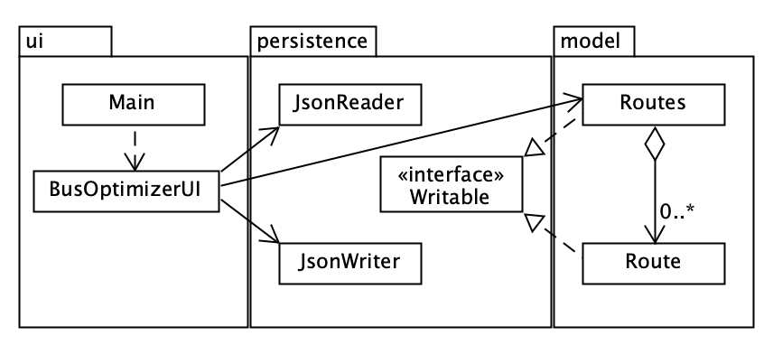

# Bus Optimizer

### Things Bus Optimizer may be able to do:
- Finds the fastest average route time for getting between two places
- Help understand which bus routes you should *not* take
- **Track statistics about your commute**

A bus speed tracking app for collecting and displaying your collected data for bus speed along a route. 
It lets you enter information about the buses taken to complete a route, and the time it takes for you to get to a location.

This app is for those taking multiple bus routes to a location regularly, and want to optimize their commute, for example, finding the average shortest time.
I would like to optimize my bus routes, since I commute for approximately 3 hours per day.

## User Stories:
- As a user, I want to be able to create a new route, and add it to a list of routes.
- As a user, I want to be able to remove routes from the list of routes.
- As a user, I want to add a time to a route to a list of times.
- As a user, I want to find the average time of a route.
- As a user, I want to find the number of times I have taken a route.
- As a user, I want to be able to save my BusOptimizer data (Routes) to a file
- As a user, I want to be able to load my BusOptimizer data (Routes) from a file

## Instructions for Grader (Phase 3)
- You can generate the first and second required events related to adding Xs to a Y by clicking the add route button
    
- You can locate my visual component by adding a route or saving and loading a file 
   (it will show a little confirmation message)
    
- You can save the state of my application by clicking the save button
- You can reload the state of my application by clicking the load button
    
## Phase 4: Task 2 (sample of events)
Printing Log:

Wed Nov 23 09:01:33 PST 2022
Added a new route: as

Wed Nov 23 09:01:33 PST 2022
Added a new route: a

Wed Nov 23 09:01:33 PST 2022
Added a new route: 1234

Wed Nov 23 09:01:33 PST 2022
Finished loading routes from file

Wed Nov 23 09:01:36 PST 2022
Route a was removed

Wed Nov 23 09:01:38 PST 2022
Saved routes to file

## Phase 4: Task 3 (UML diagram of project)

## Changes That Would Improve Design:
- add exception handling / reduce code duplication in checking if an object is null
- change the method Object.equals to implement equals and hashcode (from our classes)
- add implementation for adding times to a route
- change scrolling list UI to a table type UI (which can display the data)
